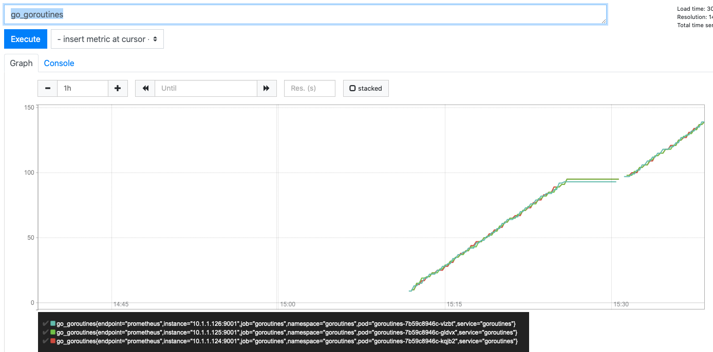

# Container debugging
This tutorial is intended to teach some basics around container debugging, for example:
1. What is happening in our container builds?
1. What is running in the container?
1. How do I know it's running?
1. How do I tell if it's not happy?
1. How do I prevent fallout from unhappy containers?

## Workshop
- We're going to be working in the `./container-debugging` for all commands, so run `cd container-debugging` and then do a `docker build -t goroutines:1.0.0 .`
- Open up the `Dockerfile` and the `main.go` file. 
    1. Do you understand what's happening in the Dockerfile, i.e what is the build process for this program?
    1. Is there anything particularly interesting happening in `main.go`?
- Let's run this in kubernetes by running `kubectl apply -f manifests`
- Now exec into it using `kubectl exec <pod-name> -n goroutines -it -- /bin/sh` - what happens and why?
- Let's change the Dockerfile so it uses `golang:1.13-alpine` as the running docker image rather than scratch, rebuild, reapply and then try exec again and you should get an interactive shell.
- We want to check out
    1. Whether our program is running
    1. What it might be doing

### Debugging the ol' fashioned way
- Let's start by running `top` - what do you see? `top` gives you a listing of the processes running on any linux or darwin machine. It's useful for debugging where your processes are using a lot of memory or CPU. Pay close attention in this case to "Mem" which is memory usage.
- Using top like this is all well and good, but we've had to change the image and rebuild it in order to access it, and we don't need a shell for anything but debugging. An alternative to this is `pprof` which is a go tool for exposing details like memory, goroutines running over HTTP.
- To run pprof in your go program let's open up `main.go` and add a call to `exposePprof()` before the for loop, then rebuild it, retag it and update the manifest with the new tag, then reapply it.
- Now we can expose it using port-forward - `kubectl port-forward <pod-name> -n goroutines 6060`, aaand if you go to `http://localhost:6060/debug/pprof/goroutine?debug=1` you should see something like this: 
    - **What's going on here?** This view gives us a dump of the goroutines running within this container. If you refresh and look at the total, you should see something interesting.
- This view is good for a snapshot of what happened just now, but usually when debugging a problem, we want to know things like:
    1. How long has this been occurring?
    1. How quickly is it getting worse?
    
    in order to narrow down the problem and understand the impact of fixing it. To see this, we're going to try out prometheus to get some pretty graphs.
### Using prometheus
- Open up `manifests/deployment.yaml`. You should see the usual deployment yaml used in other tutorials in this repo, but in addition to that there's a `prometheus` port.
    - Prometheus is a time series data store for monitoring
    - It collects data by pulling it from sources - so,
        1. you configure prometheus to have a bunch of data sources
        1. you configure your app to expose a source over HTTP
        1. prometheus scrapes the data source on a given repetition (e.g every 10 seconds)
        1. ???
        1. Profit
- First up to get using this, let's install prometheus - run `kubectl apply -f manifests/bundle.yaml`. This installs the prometheus operator which makes configuration and installation of prometheus servers more manageable.
- Next, let's create an instance of prometheus by running `kubectl apply -f manifests/prometheus.yaml`. If you open that file up you should see:
    - A service monitor. This is an abstracted version of the prometheus yaml that determines which pods/services to scrape.
    - A prometheus. This is the server itself and determines which service monitors to select and include in scraper config.
    - A service. This is so that we can expose it in or outside the cluster.
- After you've done that, run `kubectl port-forward service/prometheus -n goroutines 9090` and navigate to `http://localhost:9090/targets`. You should see 3 targets, all of which are down
    - why are there 3?
    - Why are they down?
- To figure out point 2, run `kubectl port-forward service/goroutines -n goroutines 9001` and navigate to `http://localhost:9001/metrics`
    - To fix, check out `main.go` again and add a call to `exposePrometheus()`, then retag/redeploy.
- Finally, let's actually do something with prometheus. Back in the prometheus UI click "Graph" and then enter `go_goroutines` and click execute and you should get a nice graph: 

## Wider reading
- [rakyll's blog on pprof UI](https://rakyll.org/pprof-ui/)
- [Julia Evan's blog on pprof](https://jvns.ca/blog/2017/09/24/profiling-go-with-pprof/)