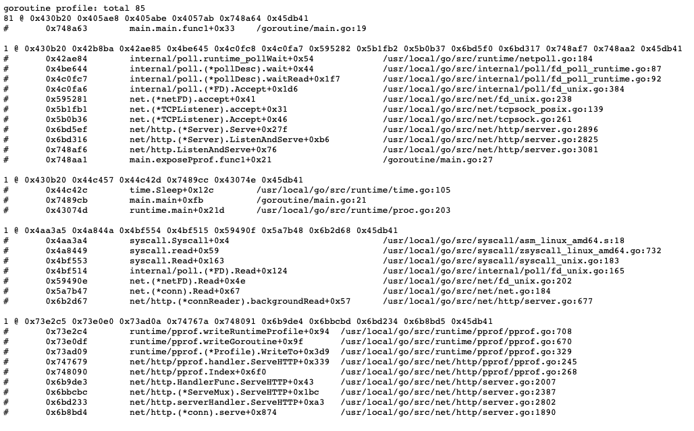

# Container debugging
This tutorial is intended to teach some basics around container debugging, for example:
1. What is happening in our container builds?
1. What is running in the container?
1. How do I know it's running?
1. How do I tell if it's not happy?

## Workshop
- We're going to be working in the `./container-debugging` for all commands, so run `cd container-debugging` and then do a `docker build -t goroutines:1.0.0 .`
- Open up the `Dockerfile` and the `main.go` file. 
    1. Do you understand what's happening in the Dockerfile, i.e what is the build process for this program?
    1. Is there anything particularly interesting happening in `main.go`?
- Let's run this in kubernetes by running `kubectl apply -f manifests`
- Now exec into it using `kubectl exec <pod-name> -n goroutines -it -- /bin/sh` - what happens and why?
- Let's change the Dockerfile so it uses `golang:1.13-alpine` as the running docker image rather than scratch, rebuild, reapply and then try exec again and you should get an interactive shell.
- We want to check out
    1. Whether our program is running
    1. What it might be doing
- Let's start by running `top` - what do you see? `top` gives you a listing of the processes running on any linux or darwin machine. It's useful for debugging where your processes are using a lot of memory or CPU. Pay close attention in this case to "Mem" which is memory usage.
- Using top like this is all well and good, but we've had to change the image and rebuild it in order to access it, and we don't need a shell for anything but debugging. An alternative to this is `pprof` which is a go tool for exposing details like memory, goroutines running over HTTP.
- To run pprof in your go program let's open up `main.go` and add a call to `exposePprof()` before the for loop, then rebuild it, retag it and update the manifest with the new tag, then reapply it.
- Now we can expose it using port-forward - `kubectl port-forward <pod-name> -n goroutines 6060`, aaand if you go to `http://localhost:6060/debug/pprof/goroutine?debug=1` you should see something like this: 
    - What's going on here? This view gives us a dump of the goroutines running within this container. If you refresh and look at the total, you should see something interesting.

